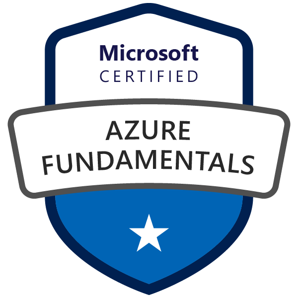

# Certifications
A place to store all my relevant certifications

##  Azure 

&emsp; &emsp; &emsp; &emsp; [Certificate](Microsoft%20Azure%20Fundamentals.pdf) | [Credly](https://www.credly.com/badges/c0c591e2-23fa-4b12-991c-a2a4a97c83fd/public_url)

## IBM Data Analyst Program
Received IBM Professional Certificate on April 2023

&emsp; &emsp; &emsp; &emsp; [Certificate](0-IBM%20Data%20Analyst%20Professional%20Certificate.pdf) | [Coursera](https://www.coursera.org/programs/jda20231t5-xjfkx/professional-certificates/ibm-data-analyst)

### Awarded on completing the following courses:

Course 1: Introduction to Data Analytics

&emsp; &emsp; &emsp; &emsp; [Certificate]() | [Coursera](https://www.coursera.org/programs/jda20231t5-xjfkx/learn/introduction-to-data-analytics)

Course 2: Excel Basics for Data Analysis

&emsp; &emsp; &emsp; &emsp; [Certificate]() | [Coursera](https://www.coursera.org/programs/jda20231t5-xjfkx/learn/excel-basics-data-analysis-ibm)

Course 3: Data Visualization and Dashboards with Excel and Cognos

&emsp; &emsp; &emsp; &emsp; [Certificate]() | [Coursera](https://www.coursera.org/programs/jda20231t5-xjfkx/learn/data-visualization-dashboards-excel-cognos?specialization=ibm-data-analyst)

Course 4: Python for Data Science, AI & Development

&emsp; &emsp; &emsp; &emsp; [Certificate]() | [Coursera](https://www.coursera.org/programs/jda20231t5-xjfkx/learn/python-for-applied-data-science-ai?specialization=ibm-data-analyst)

Course 5: Python Project for Data Science

&emsp; &emsp; &emsp; &emsp; [Certificate]() | [Coursera](https://www.coursera.org/programs/jda20231t5-xjfkx/learn/python-project-for-data-science?specialization=ibm-data-analyst)

Course 6: Databases and SQL for Data Science with Python

&emsp; &emsp; &emsp; &emsp; [Certificate]() | [Coursera](https://www.coursera.org/programs/jda20231t5-xjfkx/learn/sql-data-science?specialization=ibm-data-analyst)

Course 7: Data Analysis with Python

&emsp; &emsp; &emsp; &emsp; [Certificate]() | [Coursera](https://www.coursera.org/programs/jda20231t5-xjfkx/learn/data-analysis-with-python?specialization=ibm-data-analyst)

Course 8: Data Visualization with Python

&emsp; &emsp; &emsp; &emsp; [Certificate]() | [Coursera](https://www.coursera.org/programs/jda20231t5-xjfkx/learn/python-for-data-visualization?specialization=ibm-data-analyst)

Course 9: IBM Data Analyst Capstone Project

&emsp; &emsp; &emsp; &emsp; [Certificate]() | [Coursera](https://www.coursera.org/programs/jda20231t5-xjfkx/learn/ibm-data-analyst-capstone-project?specialization=ibm-data-analyst)
